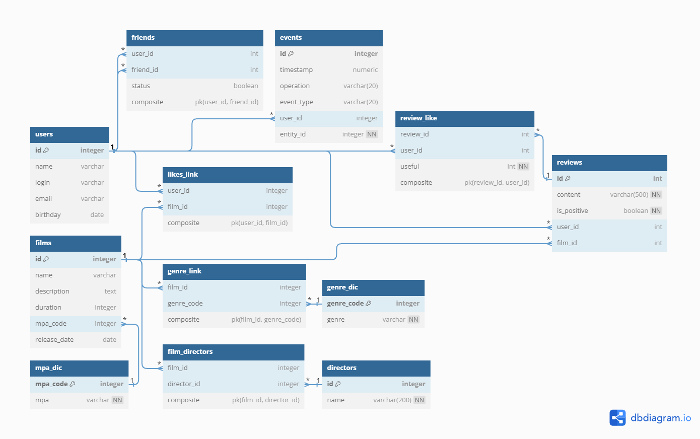

# Filmorate: A Social Platform for Film Enthusiasts
# Filmorate: Социальная Платформа для Ценителей Кино

## Introduction
Welcome to Filmorate, a social platform for film enthusiasts. Our goal is to connect movie lovers and enhance their viewing experience with various interactive features.

## Введение
Filmorate — это платформа, созданная для объединения любителей кино. Она предлагает широкий спектр функций для поиска и оценки фильмов. Пользователи могут добавлять и оценивать фильмы, писать отзывы и получать персонализированные рекомендации. Платформа позволяет пользователям делиться впечатлениями с друзьями и рекомендовать фильмы друг другу.

## Features
- **Add and Rate Films**: Discover new films and share your ratings.
- **Write Reviews**: Express your thoughts and read opinions from others.
- **Personalized Recommendations**: Get movie suggestions based on your preferences.
- **Social Connectivity**: Connect with friends, share likes, and recommend movies.
- **News Feed**: Stay updated with the latest happenings in the Filmorate community.
- **Search Functionality**: Easily find movies with keywords from titles or descriptions.
- **Comprehensive Database**: Explore a vast collection of films, directors.
- **Popular Films and Directors**: Discover trending films and renowned directors.
- **Common Films Among Friends**: Find movies you and your friends both love.
- **Friends' Likes**: See what your friends are enjoying.

## Особенности
- **Добавление и оценка фильмов**: Открывайте для себя новые фильмы и делитесь своими оценками.
- **Написание отзывов**: Выражайте свои мысли и читайте мнения других.
- **Персонализированные рекомендации**: Получайте предложения фильмов, исходя из ваших предпочтений.
- **Социальное взаимодействие**: Общайтесь с друзьями, делитесь впечатлениями и рекомендуйте фильмы.
- **Лента новостей**: Оставайтесь в курсе последних событий в сообществе Filmorate.
- **Функционал поиска**: Легко находите фильмы по ключевым словам из названий или описаний.
- **Обширная база данных**: Исследуйте большую коллекцию фильмов и режиссеров.
- **Популярные фильмы**: Узнавайте о трендовых фильмах и известных режиссерах.
- **Общие фильмы с друзьями**: Находите фильмы, которые нравятся вам и вашим друзьям.
- **Лайки друзей**: Узнайте, какие фильмы нравятся вашим друзьям.

## Contact
For any queries or feedback, please contact us at osdant@yandex.ru.

## Контакты
Если у вас есть вопросы или отзывы, пожалуйста, свяжитесь с нами по адресу osdant@yandex.ru.

## Database Schema
Below is the database schema used in Filmorate:
Ниже приведена схема базы данных, используемая в Filmorate:

